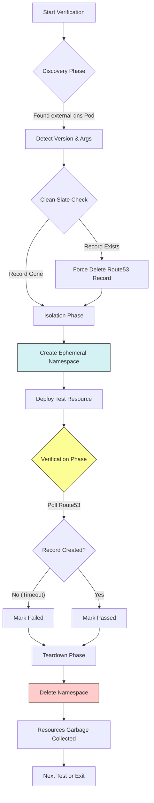

Here is the complete, final `README.md` including the Logic Flowchart and the "Disposable Namespace" architecture updates.

---

# ExternalDNS Release Verification

> Automated verification suite that validates end-to-end DNS propagation between Kubernetes and AWS Route53 for ExternalDNS releases.

## 📖 Overview

This script performs "Black Box" testing to verify that a deployed version of `external-dns` is functioning correctly. It is designed to run either manually by platform engineers or automatically as a **PostSync Hook** in ArgoCD during release pipelines. It deploys real Kubernetes resources and asserts that the corresponding DNS records are correctly created in and removed from AWS Route53.

**Key Features:**

* **Smart Discovery:** Automatically detects the running configuration (version, sources, `upsert-only` mode, private/public zones) by inspecting the active `external-dns` Pod.
* **Disposable Sandboxes:** Creates ephemeral, random namespaces for each test case to ensure zero collisions and clean teardowns.
* **Self-Healing:** Includes "Clean Slate" logic to forcibly remove stale Route53 records before testing to prevent false positives.

## 🧠 How It Works

The script follows a rigorous verification lifecycle for each supported source (Service, Ingress, Gateway).



### Execution Steps

1. **Discovery:** Connects to the cluster, finds the active `external-dns` pod, and validates its version and CLI arguments.
2. **Clean Slate:** Checks AWS Route53 to ensure the target DNS record does *not* exist. If found, it forces a cleanup.
3. **Isolation:** Creates a temporary, unique Kubernetes Namespace (e.g., `verification-extdns-service`).
4. **Deployment:** Deploys the test resource (e.g., Nginx Service) into the temporary namespace.
5. **Verification:** Polls the AWS Route53 API until the expected `A` and `TXT` records appear.
6. **Teardown:** Deletes the temporary namespace (instantly cleaning up K8s resources) and ensures Route53 records are removed.

## 🛠️ Configuration

The application is configured entirely via Environment Variables.

| Variable | Description | Required | Default |
| --- | --- | --- | --- |
| `HOSTED_ZONE_NAME` | The target Route53 Hosted Zone domain (e.g., `dev.example.com.`) | **Yes** | - |
| `TEST_IMAGE` | Docker image to use for dummy test pods (e.g., `nginx:alpine`) | **Yes** | - |
| `EXTERNAL_DNS_EXPECTED_VERSION` | The version string to verify (e.g., `v0.14.0`) | **Yes** | - |
| `AWS_REGION` | AWS Region for Route53 API calls | No | `ap-east-1` |
| `TEST_NAMESPACE` | Base name for test namespaces | No | `verification-external-dns` |

## 🔐 Permissions & Remote Execution

This script is designed to run remotely (e.g., ArgoCD). It requires the following permissions:

### AWS IAM (Service Account)

If running on EKS with IRSA, the Service Account requires:

* **Policy:** `AmazonRoute53DomainsFullAccess` (or scoped equivalent)
* **Specific Actions:**
* `route53:ListHostedZones`
* `route53:ListResourceRecordSets`
* `route53:ChangeResourceRecordSets`
* `route53:GetChange`


### Kubernetes RBAC

The runner requires a `Role` or `ClusterRole` with access to:

* **Namespaces:** `[create, delete, get, list]`
* **Pods:** `[list, get]` (To inspect the external-dns controller)
* **Services / Ingresses / Gateways:** `[create, get, delete]` (To deploy test resources)

## 💻 Local Development

### Prerequisites

* **Language Runtime:** Python 3.11+
* **Tools:** `kubectl`, `aws-cli`
* **Python Manager:** `uv`

### Running Locally

#### Option A: Python (via `uv`)

We use `uv` for dependency management and execution. Do not manually create venvs.

1. **Define Environment Variables:** Create a `.env` file or pass variables inline.
```bash
# Create a local .env file
echo "HOSTED_ZONE_NAME=dev.example.com." > .env
echo "TEST_IMAGE=nginx:alpine" >> .env
echo "EXTERNAL_DNS_EXPECTED_VERSION=v0.14.0" >> .env

```


2. **Run the Script:** Use `uv run` with the `--env-file` flag to execute the entry point.
```bash
# Run with .env file (Recommended)
uv run --env-file .env main.py

# OR run with inline flags
HOSTED_ZONE_NAME=dev.example.com. TEST_IMAGE=nginx:alpine uv run main.py

```


## 🔗 Resources

* **Runbook:** [Link to Confluence/Notion Runbook]
* **Related Repo:** [Link to external-dns-charts or infra repo]
* **Container Image:** [Link to ECR/Artifactory]

## ❓ Troubleshooting

**Issue: "DNS Propagation Timed Out"**

* **Cause:** Route53 updates can take up to 60s. Sometimes `external-dns` is slow to pick up the change if the sync interval is high.
* **Fix:** Check `external-dns` pod logs to see if it processed the event. Verify `AWS_REGION` matches the Hosted Zone.

**Issue: "Permission Denied: namespaces"**

* **Cause:** The script tries to create/delete namespaces for isolation.
* **Fix:** Ensure your local kubecontext or the ArgoCD ServiceAccount has `ClusterRole` permissions for Namespaces.

## 📂 Project Structure

```text
.
├── main.py                 # Entry point (Signal Handling & Logging)
├── lib/
│   ├── config.py           # Config loading & Validation
│   ├── k8s.py              # Infra Manager & Deployment Logic
│   ├── route53.py          # AWS Boto3 Wrappers
│   ├── external_dns.py     # Discovery Logic
│   └── utils.py            # Test Suite Runners
├── manifests/              # YAML templates for test resources
│   ├── service.yaml
│   ├── ingress.yaml
│   └── gateway.yaml
├── pyproject.toml          # Python dependencies (managed by uv)
└── README.md

```