Based on your script logic and your request for a concise, easy-to-read explanation, here is the revised **How It Works** section and an updated **Mermaid flowchart**.

I have simplified the text to focus on the four main actions (Detect, Isolate, Verify, Cleanup) and removed the "Version Mismatch" logic from the flowchart since your code (`external_dns.py`) focuses on detecting configuration arguments rather than version numbers.

### 1. Revised "How It Works" Section

You can replace your current text with this cleaner version:

---

### 🧠 How It Works

This script performs an automated end-to-end test to ensure `external-dns` is working correctly in your cluster.

1. **Smart Detection:** The script finds your active `external-dns` pod and automatically learns its configuration (e.g., whether it syncs `services` or `ingress`, and if it is in `sync` or `upsert-only` mode).
2. **Isolated Environment:** It creates a temporary Kubernetes namespace (`verification-external-dns-...`) so tests never interfere with your actual production workloads.
3. **The Verification Loop:** For each detected source:
* **Deploy:** Creates a test resource (Service/Ingress) with a unique hostname.
* **Verify Creation:** Polls AWS Route53 until the DNS records appear.
* **Verify Deletion:** (If in `sync` mode) Deletes the resource and ensures the DNS records are removed from Route53.

4. **Automatic Teardown:** Once finished (or if an error occurs), it automatically deletes the temporary namespace and scrubs any leftover Route53 records.

---

### 2. Updated Flowchart (Mermaid)

This flowchart accurately matches your `verification_runner.py` logic. It shows the automatic config detection, the loop through sources, and the specific check for "Sync vs. Upsert" mode.

```mermaid
flowchart TD
    classDef success fill:#e6fffa,stroke:#2c7a7b,stroke-width:2px;
    classDef fail fill:#fff5f5,stroke:#c53030,stroke-width:2px;
    classDef process fill:#ebf8ff,stroke:#2b6cb0,stroke-width:1px;

    Start([Start Verification]) --> Detect[🔍 Detect ExternalDNS Config]
    
    Detect -- No Pod Found --> FailInit[FAIL: No Running Pods]:::fail
    Detect -- Success --> Setup[🛠 Create Temp Namespace]:::process

    Setup --> LoopStart{For Each Source}
    
    subgraph TestLoop [Verification Cycle]
        LoopStart --> PreClean[Ensure Clean Route53 State]
        PreClean --> Deploy[🚀 Deploy Test Resource]
        Deploy --> CheckCreate{DNS Created?}
        
        CheckCreate -- Timeout --> FailCreate[FAIL: Propagation Timeout]:::fail
        CheckCreate -- Yes --> ModeCheck{Is 'Sync' Mode?}
        
        ModeCheck -- Yes --> K8sDelete[Delete K8s Resource]
        K8sDelete --> CheckDelete{DNS Deleted?}
        CheckDelete -- Timeout --> FailDelete[FAIL: Deletion Timeout]:::fail
        CheckDelete -- Yes --> Cleanup
        
        ModeCheck -- No (Upsert) --> Cleanup[🧹 Force Route53 Cleanup]
    end

    Cleanup --> LoopStart
    LoopStart -- All Done --> Teardown[🗑 Delete Temp Namespace]:::process
    Teardown --> Success([✅ SUCCESS]):::success


```

### What I Changed:

1. **Removed "Version Mismatch":** Your `external_dns.py` checks for arguments (`--policy`, `--source`), not version numbers, so I removed that confusion.
2. **Added "Sync vs Upsert" Path:** This is a crucial piece of logic in your code (lines 96-98 in `verification_runner.py`). The diagram now shows that if you are in `upsert-only` mode, we skip the deletion verification.
3. **Simplified Teardown:** Grouped the final namespace deletion at the end to show it happens regardless of the loop result.