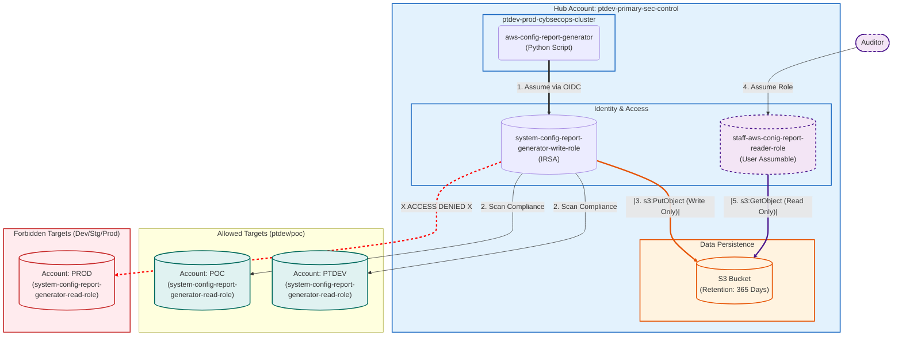

```mermaid
flowchart TD
    %% Define Styles
    classDef hub fill:#e3f2fd,stroke:#1565c0,stroke-width:2px;
    classDef spoke fill:#e0f2f1,stroke:#00695c,stroke-width:2px;
    classDef forbidden fill:#ffebee,stroke:#c62828,stroke-width:2px;
    classDef storage fill:#fff3e0,stroke:#e65100,stroke-width:2px;
    classDef user fill:#f3e5f5,stroke:#4a148c,stroke-width:2px,stroke-dasharray: 5 5;

    subgraph PTDEV_Hub ["Hub Account: ptdev-primary-sec-control"]
        direction TB
        
        subgraph K8s ["ptdev-prod-cybsecops-cluster"]
            CronJob("aws-config-report-generator<br>(Python Script)")
        end

        subgraph IAM ["Identity & Access"]
            WriterRole[("system-config-report-generator-write-role<br>(IRSA)")]
            ReaderRole[("staff-aws-conig-report-reader-role<br>(User Assumable)")]
        end

        subgraph Data_Layer ["Data Persistence"]
            S3[("S3 Bucket<br>(Retention: 365 Days)")]
        end
    end

    subgraph Targets_Allowed ["Allowed Targets (ptdev/poc)"]
        PocSpoke[("Account: POC<br>(system-config-report-generator-read-role)")]
        PtdevSpoke[("Account: PTDEV<br>(system-config-report-generator-read-role)")]
    end

    subgraph Targets_Blocked ["Forbidden Targets (Dev/Stg/Prod)"]
        ProdSpoke[("Account: PROD<br>(system-config-report-generator-read-role)")]
    end

    User(["Auditor"])

    %% --- EXECUTION FLOW ---
    CronJob ==>|1. Assume via OIDC| WriterRole
    
    %% Audit Flow (Isolation)
    WriterRole -->|2. Scan Compliance| PocSpoke
    WriterRole -->|2. Scan Compliance| PtdevSpoke
    WriterRole -.->|X ACCESS DENIED X| ProdSpoke

    %% --- S3 WRITE OPERATION ---
    WriterRole == "|3. s3:PutObject (Write Only)|" ==> S3

    %% --- S3 READ OPERATION ---
    User -->|4. Assume Role| ReaderRole
    ReaderRole == "|5. s3:GetObject (Read Only)|" ==> S3

    %% Styling
    class PTDEV_Hub,K8s,IAM hub;
    class PocSpoke,PtdevSpoke spoke;
    class ProdSpoke,Targets_Blocked forbidden;
    class S3,Data_Layer storage;
    class User,ReaderRole user;
    
    %% Link Styles for Emphasis
    linkStyle 3 stroke:#ff0000,stroke-width:3px,stroke-dasharray: 5 5; 
    linkStyle 4 stroke:#e65100,stroke-width:3px; 
    linkStyle 6 stroke:#4a148c,stroke-width:3px;
```