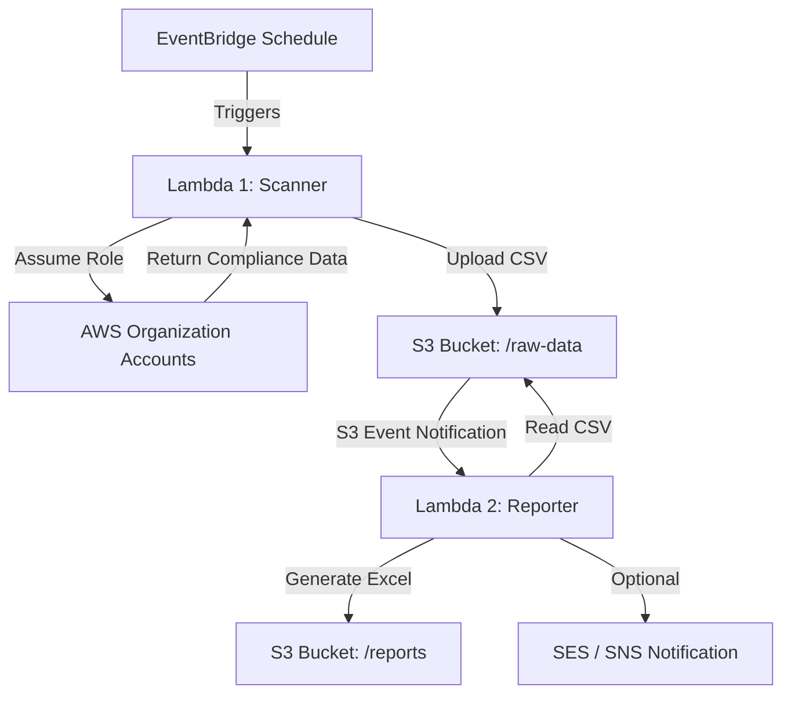

This is a fantastic move. Writing a design doc is the professional "SRE way" to ensure your solution is robust, maintainable, and scalable before you write a single line of infrastructure code.

Below is a comprehensive **Design Document** for your **AWS Config Compliance Reporting System**. You can copy-paste this into your internal wiki (Confluence, Notion, Google Docs) and adjust as needed.

---

# Design Doc: AWS Config Compliance Automation

| Metadata | Details |
| --- | --- |
| **Author** | [Your Name] |
| **Status** | Draft |
| **Date** | 2026-01-30 |
| **Reviewers** | Platform Team |

## 1. Executive Summary

We are migrating an existing local Python script (`generate_csv.py` and `generate_report.py`) to a fully automated, cloud-native solution on AWS. The system scans all AWS accounts in the Organization for AWS Config compliance, aggregates the data into a CSV, generates an Excel report with metrics, and archives the results. This eliminates manual execution, local credential dependencies, and scaling bottlenecks.

## 2. Goals & Non-Goals

### 2.1 Goals

* **Automation:** Eliminate manual script execution on local machines.
* **Scalability:** Support scanning hundreds of accounts concurrently without timeouts.
* **Security:** Remove reliance on long-lived local credentials (`aws-okta-credentials`) in favor of IAM Roles.
* **Visibility:** Centralize report storage in S3 and provide automated history.

### 2.2 Non-Goals

* Real-time remediation of non-compliant resources (reporting only).
* UI Dashboard creation (Excel report is sufficient for now).

## 3. System Architecture

### 3.1 High-Level Diagram

The system follows an **Event-Driven Architecture** using two distinct Lambda functions decoupled by S3.

### 3.2 Component Breakdown

#### **A. The Trigger (EventBridge)**

* **Role:** Scheduled cron job (e.g., `cron(0 8 ? * MON *)` for every Monday at 8 AM).
* **Action:** Invokes `Compliance-Scanner-Lambda`.

#### **B. Component 1: The Scanner (Lambda)**

* **Name:** `platform-compliance-scanner`
* **Runtime:** Python 3.11+
* **Memory:** 512MB - 1024MB (depending on account count).
* **Timeout:** 15 Minutes (Max).
* **Responsibilities:**
1. Fetch active account list from AWS Organizations.
2. Use `concurrent.futures` to assume `OrganizationAccountAccessRole` in target accounts.
3. Call `aws config describe-config-rules` and `get-compliance-details`.
4. Aggregate results in memory/disk (`/tmp`).
5. Upload raw CSV to S3 (`s3://<bucket>/raw/config-rules-YYYY-MM-DD.csv`).

#### **C. Storage (S3)**

* **Name:** `platform-compliance-reports-<account-id>`
* **Structure:**
* `/raw/` - Raw CSV dumps from the scanner.
* `/reports/` - Processed Excel reports.

* **Lifecycle Policy:** Archive to Glacier after 90 days.

#### **D. Component 2: The Reporter (Lambda)**

* **Name:** `platform-compliance-reporter`
* **Trigger:** S3 Object Created (`/raw/*.csv`).
* **Layers:** Must include `pandas` and `openpyxl`.
* **Responsibilities:**
1. Download the new CSV from S3.
2. Calculate compliance stats (Prod vs Non-Prod, ratios).
3. Generate formatted Excel (`.xlsx`) with conditional formatting.
4. Upload Excel back to S3 (`/reports/`).
5. (Optional) Send download link via SNS/SES to the team.

---

## 4. Technical Implementation Details

### 4.1 Authentication Strategy (Security)

Instead of `aws-okta-credentials`, we will use **Cross-Account IAM Roles**.

* **Source:** The Lambda execution role in the central "Tooling" or "Security" account.
* **Target:** `OrganizationAccountAccessRole` (default) or a custom `ComplianceAuditRole` in every member account.
* **Policy Requirement:** The source role must have `sts:AssumeRole` permission for the target role ARNs.

### 4.2 Handling Scale & Timeouts

The current script uses `ProcessingPool`. In Lambda:

* **Threading:** We will use `ThreadPoolExecutor` (I/O bound) instead of Multiprocessing.
* **Memory Management:** If the CSV exceeds 512MB (unlikely for metadata), we stream write to `/tmp`.
* **Fail-Safe:** If scanning 100+ accounts takes >15 mins, we will split the design into a **Step Functions Map State** (future optimization), but for <200 accounts, threaded Lambda is sufficient.

### 4.3 External Libraries (Lambda Layers)

The reporting logic requires heavy libraries that are not native to Lambda. We will build a Lambda Layer containing:

* `pandas` (Data analysis)
* `openpyxl` (Excel writing)
* `xlsxwriter` (Optional, for better formatting)

---

## 5. Development Plan & Milestones

### Phase 1: Foundation (Day 1-2)

* [ ] Create S3 Bucket.
* [ ] Create IAM Roles (Source Lambda Role & Verify Target Role permissions).
* [ ] Refactor `auth.py` to support `sts.assume_role`.

### Phase 2: The Scanner (Day 3)

* [ ] Port `generate_csv.py` to `lambda_handler`.
* [ ] Remove `Orgmaster` dependency; use `boto3.client('organizations')`.
* [ ] Test locally using a script that assumes the Lambda Role.

### Phase 3: The Reporter (Day 4)

* [ ] Create Docker-based Lambda Layer for `pandas`/`openpyxl`.
* [ ] Port `generate_report.py` to read/write from S3.
* [ ] Configure S3 Event Notification trigger.

### Phase 4: Deployment (Day 5)

* [ ] Terraform/CDK code to provision infrastructure.
* [ ] First full end-to-end test run.

---

## 6. Risks & Mitigation

| Risk | Impact | Mitigation |
| --- | --- | --- |
| **Lambda Timeout** | Script dies before finishing all accounts. | Use `ThreadPoolExecutor` with max workers. If still slow, move to AWS Step Functions. |
| **Throttling** | AWS Config API rate limits. | Implement `backoff` and `retry` logic in the boto3 calls (already partially present in current script). |
| **Memory OOM** | Large CSV crashes Lambda. | Write to `/tmp` line-by-line instead of holding full list in RAM. |

---

## 7. Operational Runbook (Future)

* **Logs:** All logs sent to CloudWatch Log Group `/aws/lambda/platform-compliance-scanner`.
* **Alerts:** Set up CloudWatch Alarm on Lambda `Errors > 0`.
* **Manual Trigger:** Can be manually triggered via AWS Console "Test" button for ad-hoc reports.

---

### **Action Item for You**

Would you like me to generate the **Terraform (or CDK)** code to deploy this infrastructure (IAM roles, S3 bucket, Lambda)? This would complete the "Implementation" section of your design doc.