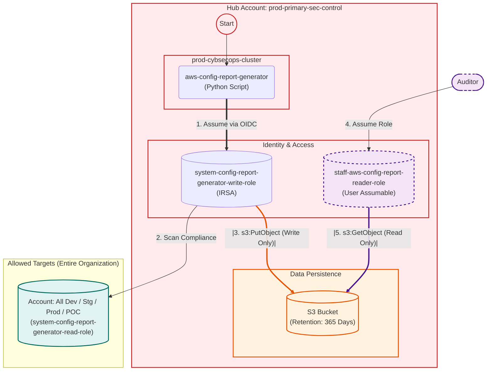

```mermaid
flowchart TD
    %% Define Styles
    classDef hub fill:#ffebee,stroke:#c62828,stroke-width:2px;
    classDef spoke fill:#e0f2f1,stroke:#00695c,stroke-width:2px;
    classDef storage fill:#fff3e0,stroke:#e65100,stroke-width:2px;
    classDef user fill:#f3e5f5,stroke:#4a148c,stroke-width:2px,stroke-dasharray: 5 5;
    
    subgraph PROD_Hub ["Hub Account: prod-primary-sec-control"]
        direction TB
        
        %% Standard Start Node
        Start((Start))

        subgraph K8s ["prod-cybsecops-cluster"]
            CronJob("aws-config-report-generator<br>(Python Script)")
        end

        subgraph IAM ["Identity & Access"]
            WriterRole[("system-config-report-generator-write-role<br>(IRSA)")]
            ReaderRole[("staff-aws-config-report-reader-role<br>(User Assumable)")]
        end

        subgraph Data_Layer ["Data Persistence"]
            S3[("S3 Bucket<br>(Retention: 365 Days)")]
        end
    end

    subgraph Targets_All ["Allowed Targets (Entire Organization)"]
        AllSpokes[("Account: All Dev / Stg / Prod / POC<br>(system-config-report-generator-read-role)")]
    end

    User(["Auditor"])

    %% --- EXECUTION FLOW ---
    %% Link 0
    Start --> CronJob
    %% Link 1
    CronJob ==>|1. Assume via OIDC| WriterRole
    
    %% Audit Flow (Universal Access)
    %% Link 2
    WriterRole -->|2. Scan Compliance| AllSpokes

    %% --- S3 WRITE OPERATION ---
    %% Link 3 (Needs Styling: Orange)
    WriterRole == "|3. s3:PutObject (Write Only)|" ==> S3

    %% --- S3 READ OPERATION ---
    %% Link 4
    User -->|4. Assume Role| ReaderRole
    %% Link 5 (Needs Styling: Purple)
    ReaderRole == "|5. s3:GetObject (Read Only)|" ==> S3

    %% Styling
    class PROD_Hub,K8s,IAM hub;
    class AllSpokes spoke;
    class S3,Data_Layer storage;
    class User,ReaderRole user;
    class Start hub;
    
    %% Link Styles (Indices corrected to 3 and 5)
    linkStyle 3 stroke:#e65100,stroke-width:3px; 
    linkStyle 5 stroke:#4a148c,stroke-width:3px;
```