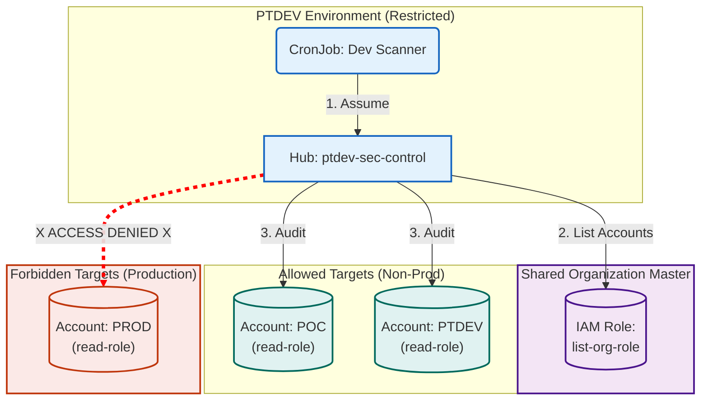
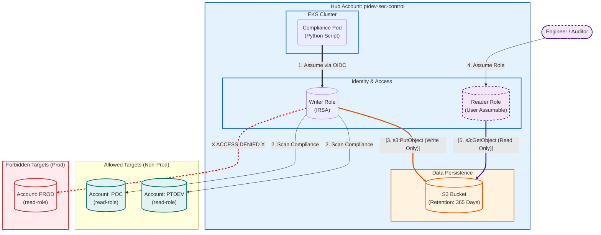

```mermaid  
flowchart TD
    %% Define Styles
    classDef devHub fill:#e3f2fd,stroke:#1565c0,stroke-width:2px;
    classDef prodHub fill:#ffebee,stroke:#c62828,stroke-width:2px;
    classDef devSpoke fill:#e0f2f1,stroke:#00695c,stroke-width:2px;
    classDef prodSpoke fill:#fbe9e7,stroke:#bf360c,stroke-width:2px;
    classDef shared fill:#f3e5f5,stroke:#4a148c,stroke-width:2px;

    subgraph Org_Master ["Shared Organization Master"]
        ListRole[("IAM Role:\nlist-org-role")]
    end

    subgraph PTDEV_Environment ["PTDEV Environment (Restricted)"]
        direction TB
        DevHub["Hub: ptdev-sec-control"]
        DevJob("CronJob: Dev Scanner")
        
        DevJob -->|1. Assume| DevHub
    end

    subgraph Target_Dev ["Allowed Targets (Non-Prod)"]
        PocSpoke[("Account: POC\n(read-role)")]
        PtdevSpoke[("Account: PTDEV\n(read-role)")]
    end

    subgraph Target_Prod ["Forbidden Targets (Production)"]
        ProdSpoke[("Account: PROD\n(read-role)")]
    end

    %% ALLOWED PATHS
    DevHub -->|2. List Accounts| ListRole
    DevHub -->|3. Audit| PocSpoke
    DevHub -->|3. Audit| PtdevSpoke

    %% BLOCKED PATHS (The Enforcement)
    DevHub -.->|X ACCESS DENIED X| ProdSpoke

    %% Styling
    class DevHub,DevJob devHub;
    class ListRole,Org_Master shared;
    class PocSpoke,PtdevSpoke devSpoke;
    class ProdSpoke,Target_Prod prodSpoke;
    
    %% Link Styling
    linkStyle 4 stroke:#ff0000,stroke-width:4px,stroke-dasharray: 5 5;
```

```mermaid
flowchart TD
    %% Define Styles
    classDef hub fill:#e3f2fd,stroke:#1565c0,stroke-width:2px;
    classDef spoke fill:#e0f2f1,stroke:#00695c,stroke-width:2px;
    classDef forbidden fill:#ffebee,stroke:#c62828,stroke-width:2px;
    classDef storage fill:#fff3e0,stroke:#e65100,stroke-width:2px;
    classDef user fill:#f3e5f5,stroke:#4a148c,stroke-width:2px,stroke-dasharray: 5 5;

    subgraph PTDEV_Hub ["Hub Account: ptdev-sec-control"]
        direction TB
        
        subgraph K8s ["EKS Cluster"]
            Pod("Compliance Pod\n(Python Script)")
        end

        subgraph IAM ["Identity & Access"]
            WriterRole[("Writer Role\n(IRSA)")]
            ReaderRole[("Reader Role\n(User Assumable)")]
        end

        subgraph Data_Layer ["Data Persistence"]
            S3[("S3 Bucket\n(Retention: 365 Days)")]
        end
    end

    subgraph Targets_Allowed ["Allowed Targets (Non-Prod)"]
        PocSpoke[("Account: POC\n(read-role)")]
        PtdevSpoke[("Account: PTDEV\n(read-role)")]
    end

    subgraph Targets_Blocked ["Forbidden Targets (Prod)"]
        ProdSpoke[("Account: PROD\n(read-role)")]
    end

    User(["Engineer / Auditor"])

    %% --- EXECUTION FLOW ---
    Pod ==>|1. Assume via OIDC| WriterRole
    
    %% Audit Flow (Isolation)
    WriterRole -->|2. Scan Compliance| PocSpoke
    WriterRole -->|2. Scan Compliance| PtdevSpoke
    WriterRole -.->|X ACCESS DENIED X| ProdSpoke

    %% --- S3 WRITE OPERATION ---
    WriterRole == "|3. s3:PutObject (Write Only)|" ==> S3

    %% --- S3 READ OPERATION ---
    User -->|4. Assume Role| ReaderRole
    ReaderRole == "|5. s3:GetObject (Read Only)|" ==> S3

    %% Styling
    class PTDEV_Hub,K8s,IAM hub;
    class PocSpoke,PtdevSpoke spoke;
    class ProdSpoke,Targets_Blocked forbidden;
    class S3,Data_Layer storage;
    class User,ReaderRole user;
    
    %% Link Styles for Emphasis
    linkStyle 3 stroke:#ff0000,stroke-width:3px,stroke-dasharray: 5 5; 
    linkStyle 4 stroke:#e65100,stroke-width:3px; 
    linkStyle 6 stroke:#4a148c,stroke-width:3px;
```