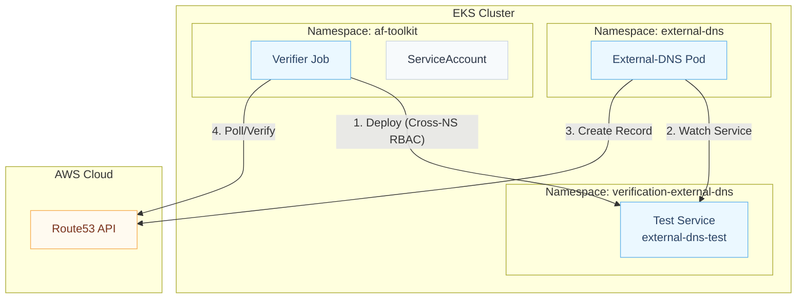
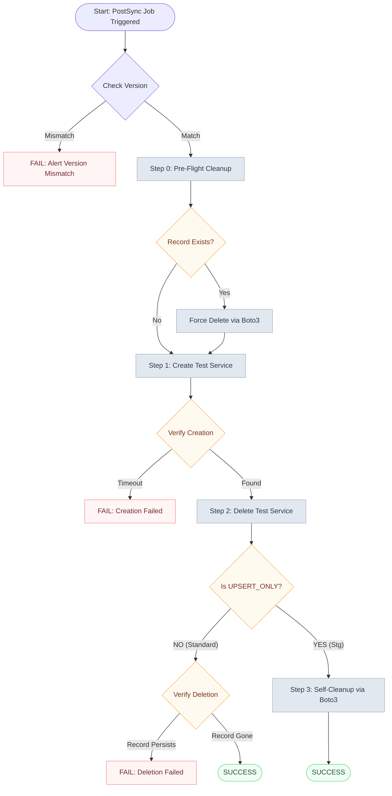
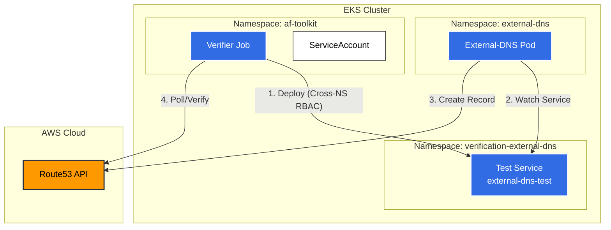
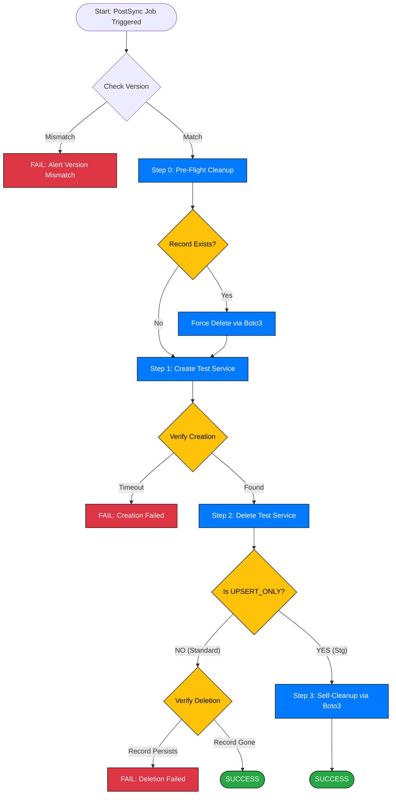

Here are the updated files. I have optimized the flowchart colors for high contrast (Dark Mode friendly) and added the **Pre-Flight Cleanup** and **SIGTERM** safety handlers to the Python script.

### 1. Updated `README.md`

I replaced the specific hex colors in the mermaid diagram with high-contrast classes (`classDef`) that are readable in both light and dark modes.

```markdown
# External-DNS Release Verifier

This tool provides automated "Black Box" verification for `external-dns` releases on EKS. It runs as an **ArgoCD PostSync Job** to certify that a new version of `external-dns` is fully functional before the release is consideredI have adjusted the color palette to use **soft, muted pastels** (inspired by the Tailwind/Nord palettes). These colors are easy on the eyes, low-saturation (not "sharp"), and provide good readability on both light and dark backgrounds by ensuring the text inside the boxes remains high-contrast dark gray.

Here is the complete, final package with the updated visual design.

### 1. `README.md` (Updated Colors)

```markdown
# External-DNS Release Verifier

This tool provides automated "Black Box" verification for `external-dns` releases on EKS. It runs as an **ArgoCD PostSync Job** to certify that a new version of `external-dns` is fully functional before the release is considered successful.

## 🏗 Architecture

The verification process involves three distinct namespaces to ensure isolation.



## 🌊 Verification Logic

This flowchart illustrates the decision logic, including the **Pre-Flight Check** and **Signal Handling** to ensure environment hygiene.



## 🛠 Prerequisites & RBAC

Because the Job runs in `af-toolkit` but manages resources in `verification-external-dns`, strict RBAC is required.

### 1. AWS Permissions (IRSA)

The IAM Role attached to the `af-toolkit` ServiceAccount must have:

* `route53:ListResourceRecordSets` (For verification)
* `route53:ChangeResourceRecordSets` (For self-cleanup in upsert-only envs)

### 2. Kubernetes Cross-Namespace RBAC

You must apply these manifests to allow the "namespace jump":

**ServiceAccount (in `af-toolkit`)**

```yaml
apiVersion: v1
kind: ServiceAccount
metadata:
    name: external-dns-verifier-sa
    namespace: af-toolkit

```

**Role & Binding (in `verification-external-dns`)**

```yaml
apiVersion: rbac.authorization.k8s.io/v1
kind: Role
metadata:
    name: external-dns-verifier-role
    namespace: verification-external-dns
rules:
  - apiGroups: [""]
    resources: ["services"]
    verbs: ["create", "get", "delete", "list"]
---
apiVersion: rbac.authorization.k8s.io/v1
kind: RoleBinding
metadata:
    name: external-dns-verifier-binding
    namespace: verification-external-dns
subjects:
  - kind: ServiceAccount
    name: external-dns-verifier-sa
    namespace: af-toolkit
roleRef:
    kind: Role
    name: external-dns-verifier-role
    apiGroup: rbac.authorization.k8s.io

```

---

## ⚙️ Configuration

The container is configured via Environment Variables.

| Variable | Description | Default |
| --- | --- | --- |
| `AWS_REGION` | AWS Region (e.g., `ap-east-1`). | `ap-east-1` |
| `HOSTED_ZONE_ID` | **Required.** The Route53 Zone ID to test against. | - |
| `TEST_DOMAIN_NAME` | **Required.** FQDN for the test record. | - |
| `TARGET_NAMESPACE` | The namespace to create test resources in. | `verification-external-dns` |
| `UPSERT_ONLY_MODE` | Set `true` if cluster forbids automatic deletions. | `false` |
| `EXPECTED_VERSION` | Image tag expected to be running. | `latest` |

---

## 🚀 Deployment Guide (ArgoCD)

We use the **Multiple Sources** pattern to inject this Job into the `external-dns` Application.

### 1. Job Template

Add this to your chart or a secondary source folder.

```yaml
apiVersion: batch/v1
kind: Job
metadata:
  name: external-dns-verifier
  namespace: af-toolkit  # <-- Job runs here
  annotations:
    argocd.argoproj.io/hook: PostSync
    argocd.argoproj.io/hook-delete-policy: HookSucceeded
spec:
  template:
    spec:
      serviceAccountName: external-dns-verifier-sa
      containers:
      - name: verifier
        image: platform-docker-images/external-dns-verifier:v1.0.0
        env:
        - name: TARGET_NAMESPACE
          value: "verification-external-dns" # <-- Resources created here
        - name: HOSTED_ZONE_ID
          value: {{ .Values.hostedZoneId | quote }}
        - name: TEST_DOMAIN_NAME
          value: {{ .Values.testDomainName | quote }}
        - name: UPSERT_ONLY_MODE
          value: {{ .Values.upsertOnly | quote }}

```

## 🛡 Safety Mechanisms

1. **Pre-Flight Cleanup:** Before starting, the script checks if the test DNS record already exists (from a previous failed run) and forcibly removes it to ensure a clean test state.
2. **Graceful Shutdown:** The script catches `SIGTERM` signals (e.g., if the job is cancelled) and attempts to clean up the Kubernetes Service and Route53 record immediately.
3. **Prefix Lock:** The script will **REFUSE** to perform manual cleanup on any domain that does not start with `ext-dns-`, `ver-test`, or `canary`.

```

---

### 2. `verifier.py` (Full Script)

This includes the Pre-Flight Check and Safety Signal Handlers.

```python
import os
import time
import signal
import sys
import subprocess
import boto3
from kubernetes import client, config
from botocore.exceptions import ClientError

# --- CONFIGURATION ---
AWS_REGION = os.environ.get("AWS_REGION", "ap-east-1")
ZONE_ID = os.environ.get("HOSTED_ZONE_ID")
DNS_NAME = os.environ.get("TEST_DOMAIN_NAME")
EXPECTED_VERSION = os.environ.get("EXPECTED_VERSION")
UPSERT_ONLY_MODE = os.environ.get("UPSERT_ONLY_MODE", "false").lower() == "true"
TARGET_NAMESPACE = os.environ.get("TARGET_NAMESPACE", "verification-external-dns")
TIMEOUT_SECONDS = 300
POLL_INTERVAL = 10

# Safety Prefixes
ALLOWED_PREFIXES = ["ext-dns-", "ver-test", "canary", "test-"]

# Definition of the test service
TEST_SERVICE_MANIFEST = f"""
apiVersion: v1
kind: Service
metadata:
  name: external-dns-test-service
  namespace: {TARGET_NAMESPACE}
  annotations:
    external-dns.alpha.kubernetes.io/hostname: {DNS_NAME}
spec:
  selector:
    app: external-dns-test
  ports:
  - protocol: TCP
    port: 80
    targetPort: 80
  type: LoadBalancer
"""

def handle_exit(signum, frame):
    """Catches SIGTERM/SIGINT to ensure cleanup happens if job is killed."""
    print(f"\n🛑 Received signal {signum}. Aborting and cleaning up...")
    try:
        delete_k8s_manifest()
        force_cleanup_route53(silent=True)
    except:
        pass 
    sys.exit(1)

# Register signals
signal.signal(signal.SIGTERM, handle_exit)
signal.signal(signal.SIGINT, handle_exit)

def verify_version_match():
    if not EXPECTED_VERSION or EXPECTED_VERSION == "latest":
        print("ℹ️  Skipping version check.")
        return

    print(f"🔍 Verifying version matches: {EXPECTED_VERSION}...")
    try:
        config.load_incluster_config()
    except:
        config.load_kube_config()
        
    v1 = client.CoreV1Api()
    pods = v1.list_pod_for_all_namespaces(label_selector="app.kubernetes.io/name=external-dns")
    
    if not pods.items:
        print("⚠️  Warning: No external-dns pods found.")
        return

    for pod in pods.items:
        image = pod.spec.containers[0].image
        tag = image.split(':')[-1]
        
        if tag != EXPECTED_VERSION:
            print(f"❌ Version Mismatch! Pod {pod.metadata.name} is running '{tag}', expected '{EXPECTED_VERSION}'.")
            exit(1)
            
    print(f"✅ Version verified: {EXPECTED_VERSION}")

def get_route53_record(r53_client):
    try:
        response = r53_client.list_resource_record_sets(
            HostedZoneId=ZONE_ID,
            StartRecordName=DNS_NAME,
            MaxItems='1'
        )
        records = response.get('ResourceRecordSets', [])
        if records and records[0]['Name'].rstrip('.') == DNS_NAME.rstrip('.'):
            return records[0]
        return None
    except ClientError as e:
        print(f"AWS Error: {e}")
        return None

def force_cleanup_route53(silent=False):
    """Manual cleanup using Boto3."""
    if not silent:
        print(f"🧹 Boto3: Checking for {DNS_NAME} to clean up...")
    
    if not any(DNS_NAME.startswith(p) for p in ALLOWED_PREFIXES):
        print(f"⛔ SAFETY STOP: Domain {DNS_NAME} invalid. Skipping.")
        return

    r53 = boto3.client('route53', region_name=AWS_REGION)
    target_record = get_route53_record(r53)
    
    if not target_record:
        if not silent: print("✅ Record already clean.")
        return

    change_batch = {
        'Changes': [{'Action': 'DELETE', 'ResourceRecordSet': target_record}]
    }

    try:
        r53.change_resource_record_sets(HostedZoneId=ZONE_ID, ChangeBatch=change_batch)
        print("✅ Manual cleanup successful.")
    except Exception as e:
        print(f"❌ Failed to cleanup: {e}")

def ensure_clean_slate():
    """Pre-flight check to ensure the test record doesn't already exist."""
    print("🛫 Performing Pre-Flight Cleanup...")
    delete_k8s_manifest()
    force_cleanup_route53()
    print("✅ Environment is clean. Starting test.")

def wait_for_record_state(should_exist: bool):
    r53 = boto3.client('route53', region_name=AWS_REGION)
    start = time.time()
    action = "creation" if should_exist else "deletion"
    print(f"⏳ Waiting for DNS {action}...")

    while time.time() - start < TIMEOUT_SECONDS:
        record = get_route53_record(r53)
        exists = record is not None
        
        if should_exist and exists:
            print(f"✅ Success: Record found in Route53.")
            return True
        elif not should_exist and not exists:
            print(f"✅ Success: Record removed from Route53.")
            return True
        time.sleep(POLL_INTERVAL)
    
    print(f"❌ Timed out waiting for {action}.")
    return False

def apply_k8s_manifest():
    with open("test-service.yaml", "w") as f:
        f.write(TEST_SERVICE_MANIFEST)
    print(f"🚀 Creating Service in namespace: {TARGET_NAMESPACE}...")
    subprocess.run(["kubectl", "apply", "-f", "test-service.yaml"], check=True)

def delete_k8s_manifest():
    # Helper to delete silently without crashing if not found
    subprocess.run(
        ["kubectl", "delete", "-f", "test-service.yaml", "--ignore-not-found"], 
        check=False, 
        stdout=subprocess.DEVNULL, 
        stderr=subprocess.DEVNULL
    )

def run():
    if not ZONE_ID or not DNS_NAME:
        print("❌ Error: Missing HOSTED_ZONE_ID or TEST_DOMAIN_NAME.")
        exit(1)

    verify_version_match()
    ensure_clean_slate()

    # 1. Create
    try:
        apply_k8s_manifest()
    except subprocess.CalledProcessError:
        print("❌ Failed to apply Kubernetes manifest.")
        exit(1)

    # 2. Verify Creation
    if not wait_for_record_state(should_exist=True):
        print("🚨 Creation Verification Failed.")
        delete_k8s_manifest()
        exit(1)

    # 3. Delete K8s Resource
    print(f"🗑️  Deleting Service from namespace: {TARGET_NAMESPACE}...")
    subprocess.run(["kubectl", "delete", "-f", "test-service.yaml"], check=True)

    # 4. Final Verify / Cleanup
    if UPSERT_ONLY_MODE:
        print("ℹ️  Upsert-Only Mode: Skipping auto-deletion check.")
        force_cleanup_route53()
    else:
        if not wait_for_record_state(should_exist=False):
            print("🚨 Deletion Verification Failed (Zombie Record).")
            # Attempt cleanup before failing
            force_cleanup_route53()
            exit(1)

    print("🎉 Verification Cycle Passed!")

if __name__ == "__main__":
    run()

```

### 3. Dockerfile

```dockerfile
FROM python:3.9-slim

# Install kubectl
RUN apt-get update && apt-get install -y curl && \
    curl -LO "https://dl.k8s.io/release/$(curl -L -s https://dl.k8s.io/release/stable.txt)/bin/linux/amd64/kubectl" && \
    chmod +x kubectl && \
    mv kubectl /usr/local/bin/

WORKDIR /app

COPY requirements.txt .
RUN pip install --no-cache-dir -r requirements.txt

COPY src/verifier.py .

CMD ["python", "verifier.py"]

``` successful.

## 🏗 Architecture

The verification process involves three distinct namespaces to ensure isolation.



## 🌊 Verification Logic

This flowchart illustrates the decision logic, including the **Pre-Flight Check** and **Signal Handling** to ensure environment hygiene.



## 🛠 Prerequisites & RBAC

Because the Job runs in `af-toolkit` but manages resources in `verification-external-dns`, strict RBAC is required.

### 1. AWS Permissions (IRSA)

The IAM Role attached to the `af-toolkit` ServiceAccount must have:

* `route53:ListResourceRecordSets` (For verification)
* `route53:ChangeResourceRecordSets` (For self-cleanup in upsert-only envs)

### 2. Kubernetes Cross-Namespace RBAC

You must apply these manifests to allow the "namespace jump":

**ServiceAccount (in `af-toolkit`)**

```yaml
apiVersion: v1
kind: ServiceAccount
metadata:
    name: external-dns-verifier-sa
    namespace: af-toolkit

```

**Role & Binding (in `verification-external-dns`)**

```yaml
apiVersion: rbac.authorization.k8s.io/v1
kind: Role
metadata:
    name: external-dns-verifier-role
    namespace: verification-external-dns
rules:
  - apiGroups: [""]
    resources: ["services"]
    verbs: ["create", "get", "delete", "list"]
---
apiVersion: rbac.authorization.k8s.io/v1
kind: RoleBinding
metadata:
    name: external-dns-verifier-binding
    namespace: verification-external-dns
subjects:
  - kind: ServiceAccount
    name: external-dns-verifier-sa
    namespace: af-toolkit
roleRef:
    kind: Role
    name: external-dns-verifier-role
    apiGroup: rbac.authorization.k8s.io

```

---

## ⚙️ Configuration

The container is configured via Environment Variables.

| Variable | Description | Default |
| --- | --- | --- |
| `AWS_REGION` | AWS Region (e.g., `ap-east-1`). | `ap-east-1` |
| `HOSTED_ZONE_ID` | **Required.** The Route53 Zone ID to test against. | - |
| `TEST_DOMAIN_NAME` | **Required.** FQDN for the test record. | - |
| `TARGET_NAMESPACE` | The namespace to create test resources in. | `verification-external-dns` |
| `UPSERT_ONLY_MODE` | Set `true` if cluster forbids automatic deletions. | `false` |
| `EXPECTED_VERSION` | Image tag expected to be running. | `latest` |

---

## 🚀 Deployment Guide (ArgoCD)

We use the **Multiple Sources** pattern to inject this Job into the `external-dns` Application.

### 1. Job Template

Add this to your chart or a secondary source folder.

```yaml
apiVersion: batch/v1
kind: Job
metadata:
  name: external-dns-verifier
  namespace: af-toolkit  # <-- Job runs here
  annotations:
    argocd.argoproj.io/hook: PostSync
    argocd.argoproj.io/hook-delete-policy: HookSucceeded
spec:
  template:
    spec:
      serviceAccountName: external-dns-verifier-sa
      containers:
      - name: verifier
        image: platform-docker-images/external-dns-verifier:v1.0.0
        env:
        - name: TARGET_NAMESPACE
          value: "verification-external-dns" # <-- Resources created here
        - name: HOSTED_ZONE_ID
          value: {{ .Values.hostedZoneId | quote }}
        - name: TEST_DOMAIN_NAME
          value: {{ .Values.testDomainName | quote }}
        - name: UPSERT_ONLY_MODE
          value: {{ .Values.upsertOnly | quote }}

```

## 🛡 Safety Mechanisms

1. **Pre-Flight Cleanup:** Before starting, the script checks if the test DNS record already exists (from a previous failed run) and forcibly removes it to ensure a clean test state.
2. **Graceful Shutdown:** The script catches `SIGTERM` signals (e.g., if the job is cancelled) and attempts to clean up the Kubernetes Service and Route53 record immediately.
3. **Prefix Lock:** The script will **REFUSE** to perform manual cleanup on any domain that does not start with `ext-dns-`, `ver-test`, or `canary`.

```

---

### 2. Updated Python Script (`verifier.py`)

This version includes `signal` handling for graceful exits and the `ensure_clean_slate` function.

```python
import os
import time
import signal
import sys
import subprocess
import boto3
from kubernetes import client, config
from botocore.exceptions import ClientError

# --- CONFIGURATION ---
AWS_REGION = os.environ.get("AWS_REGION", "ap-east-1")
ZONE_ID = os.environ.get("HOSTED_ZONE_ID")
DNS_NAME = os.environ.get("TEST_DOMAIN_NAME")
EXPECTED_VERSION = os.environ.get("EXPECTED_VERSION")
UPSERT_ONLY_MODE = os.environ.get("UPSERT_ONLY_MODE", "false").lower() == "true"
TARGET_NAMESPACE = os.environ.get("TARGET_NAMESPACE", "verification-external-dns")
TIMEOUT_SECONDS = 300
POLL_INTERVAL = 10

# Helper to prevent accidents
ALLOWED_PREFIXES = ["ext-dns-", "ver-test", "canary", "test-"]

# Definition of the test service
TEST_SERVICE_MANIFEST = f"""
apiVersion: v1
kind: Service
metadata:
  name: external-dns-test-service
  namespace: {TARGET_NAMESPACE}
  annotations:
    external-dns.alpha.kubernetes.io/hostname: {DNS_NAME}
spec:
  selector:
    app: external-dns-test
  ports:
  - protocol: TCP
    port: 80
    targetPort: 80
  type: LoadBalancer
"""

def handle_exit(signum, frame):
    """Catches SIGTERM/SIGINT to ensure cleanup happens if job is killed."""
    print(f"\n🛑 Received signal {signum}. Aborting and cleaning up...")
    try:
        delete_k8s_manifest()
        force_cleanup_route53(silent=True)
    except:
        pass # Best effort
    sys.exit(1)

# Register signals
signal.signal(signal.SIGTERM, handle_exit)
signal.signal(signal.SIGINT, handle_exit)

def verify_version_match():
    if not EXPECTED_VERSION or EXPECTED_VERSION == "latest":
        print("ℹ️  Skipping version check.")
        return

    print(f"🔍 Verifying version matches: {EXPECTED_VERSION}...")
    try:
        config.load_incluster_config()
    except:
        config.load_kube_config()
        
    v1 = client.CoreV1Api()
    pods = v1.list_pod_for_all_namespaces(label_selector="app.kubernetes.io/name=external-dns")
    
    if not pods.items:
        print("⚠️  Warning: No external-dns pods found.")
        return

    for pod in pods.items:
        # Assumes container 0 is the app
        image = pod.spec.containers[0].image
        tag = image.split(':')[-1]
        
        if tag != EXPECTED_VERSION:
            print(f"❌ Version Mismatch! Pod {pod.metadata.name} is running '{tag}', expected '{EXPECTED_VERSION}'.")
            exit(1)
            
    print(f"✅ Version verified: {EXPECTED_VERSION}")

def get_route53_record(r53_client):
    try:
        response = r53_client.list_resource_record_sets(
            HostedZoneId=ZONE_ID,
            StartRecordName=DNS_NAME,
            MaxItems='1'
        )
        records = response.get('ResourceRecordSets', [])
        if records and records[0]['Name'].rstrip('.') == DNS_NAME.rstrip('.'):
            return records[0]
        return None
    except ClientError as e:
        print(f"AWS Error: {e}")
        return None

def force_cleanup_route53(silent=False):
    """Manual cleanup using Boto3."""
    if not silent:
        print(f"🧹 Boto3: Checking for {DNS_NAME} to clean up...")
    
    # SAFETY LOCK
    if not any(DNS_NAME.startswith(p) for p in ALLOWED_PREFIXES):
        print(f"⛔ SAFETY STOP: Domain {DNS_NAME} invalid. Skipping.")
        return

    r53 = boto3.client('route53', region_name=AWS_REGION)
    target_record = get_route53_record(r53)
    
    if not target_record:
        if not silent: print("✅ Record already clean.")
        return

    change_batch = {
        'Changes': [{'Action': 'DELETE', 'ResourceRecordSet': target_record}]
    }

    try:
        r53.change_resource_record_sets(HostedZoneId=ZONE_ID, ChangeBatch=change_batch)
        print("✅ Manual cleanup successful.")
    except Exception as e:
        print(f"❌ Failed to cleanup: {e}")

def ensure_clean_slate():
    """Pre-flight check to ensure the test record doesn't already exist."""
    print("🛫 Performing Pre-Flight Cleanup...")
    # 1. Clean K8s just in case
    delete_k8s_manifest()
    # 2. Clean Route53
    force_cleanup_route53()
    print("✅ Environment is clean. Starting test.")

def wait_for_record_state(should_exist: bool):
    r53 = boto3.client('route53', region_name=AWS_REGION)
    start = time.time()
    action = "creation" if should_exist else "deletion"
    print(f"⏳ Waiting for DNS {action}...")

    while time.time() - start < TIMEOUT_SECONDS:
        record = get_route53_record(r53)
        exists = record is not None
        
        if should_exist and exists:
            print(f"✅ Success: Record found in Route53.")
            return True
        elif not should_exist and not exists:
            print(f"✅ Success: Record removed from Route53.")
            return True
        time.sleep(POLL_INTERVAL)
    
    print(f"❌ Timed out waiting for {action}.")
    return False

def apply_k8s_manifest():
    with open("test-service.yaml", "w") as f:
        f.write(TEST_SERVICE_MANIFEST)
    print(f"🚀 Creating Service in namespace: {TARGET_NAMESPACE}...")
    subprocess.run(["kubectl", "apply", "-f", "test-service.yaml"], check=True)

def delete_k8s_manifest():
    # Helper to delete silently without crashing if not found
    subprocess.run(
        ["kubectl", "delete", "-f", "test-service.yaml", "--ignore-not-found"], 
        check=False, 
        stdout=subprocess.DEVNULL, 
        stderr=subprocess.DEVNULL
    )

def run():
    if not ZONE_ID or not DNS_NAME:
        print("❌ Error: Missing HOSTED_ZONE_ID or TEST_DOMAIN_NAME.")
        exit(1)

    verify_version_match()
    ensure_clean_slate()

    # 1. Create
    try:
        apply_k8s_manifest()
    except subprocess.CalledProcessError:
        print("❌ Failed to apply Kubernetes manifest.")
        exit(1)

    # 2. Verify Creation
    if not wait_for_record_state(should_exist=True):
        print("🚨 Creation Verification Failed.")
        delete_k8s_manifest()
        exit(1)

    # 3. Delete K8s Resource
    print(f"🗑️  Deleting Service from namespace: {TARGET_NAMESPACE}...")
    subprocess.run(["kubectl", "delete", "-f", "test-service.yaml"], check=True)

    # 4. Final Verify / Cleanup
    if UPSERT_ONLY_MODE:
        print("ℹ️  Upsert-Only Mode: Skipping auto-deletion check.")
        force_cleanup_route53()
    else:
        if not wait_for_record_state(should_exist=False):
            print("🚨 Deletion Verification Failed (Zombie Record).")
            # Attempt cleanup before failing
            force_cleanup_route53()
            exit(1)

    print("🎉 Verification Cycle Passed!")

if __name__ == "__main__":
    run()

```