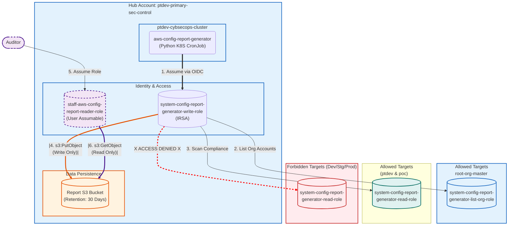

```mermaid
flowchart TD
    %% Define Styles
    classDef hub fill:#e3f2fd,stroke:#1565c0,stroke-width:2px;
    classDef master fill:#e3f2fd,stroke:#1565c0,stroke-width:2px;
    classDef spoke fill:#e0f2f1,stroke:#00695c,stroke-width:2px;
    classDef forbidden fill:#ffebee,stroke:#c62828,stroke-width:2px;
    classDef storage fill:#fff3e0,stroke:#e65100,stroke-width:2px;
    classDef user fill:#f3e5f5,stroke:#4a148c,stroke-width:2px,stroke-dasharray: 5 5;
    classDef invisible width:0px,height:0px,color:transparent,fill:transparent,stroke:none;

    subgraph PTDEV_Hub ["Hub Account: ptdev-primary-<br>sec-control"]
        direction TB
        
        %% Invisible node to push content down
        TitleSpacer[ ]:::invisible

        subgraph K8s ["ptdev-cybsecops-cluster"]
            CronJob("aws-config-report-generator<br>(Python K8S CronJob)")
        end

        subgraph IAM ["Identity & Access"]
            WriterRole[("system-config-report-<br>generator-write-role<br>(IRSA)")]
            ReaderRole[("staff-aws-config-<br>report-reader-role<br>(User Assumable)")]
        end

        subgraph Data_Layer ["Data Persistence"]
            S3[("Report S3 Bucket<br>(Retention: 30 Days)")]
        end
    end

    subgraph Org_Master ["Allowed Targets <br> root-org-master"]
        ListRole[("system-config-report-<br>generator-list-org-role")]
    end

    subgraph Targets_Allowed ["Allowed Targets <br> (ptdev & poc)"]
        %% Combined Node
        AllowedSpokes[("system-config-report-<br>generator-read-role")]
    end

    subgraph Targets_Blocked ["Forbidden Targets (Dev/Stg/Prod)"]
        ProdSpoke[("system-config-report-<br>generator-read-role")]
    end

    User(["Auditor"])

    %% --- EXECUTION FLOW ---
    %% Link 0
    TitleSpacer ~~~ CronJob
    %% Link 1
    CronJob ==>|1. Assume via OIDC| WriterRole
    
    %% Discovery Step
    %% Link 2
    WriterRole -->|2. List Org Accounts| ListRole

    %% Audit Flow (Isolation)
    %% Link 3
    WriterRole -->|3. Scan Compliance| AllowedSpokes
    %% Link 4 (Needs Red Dashed Style)
    WriterRole -.->|X ACCESS DENIED X| ProdSpoke

    %% --- S3 WRITE OPERATION ---
    %% Link 5 (Needs Orange Style)
    WriterRole == "|4. s3:PutObject <br> (Write Only)|" ==> S3

    %% --- S3 READ OPERATION ---
    %% Link 6
    User -->|5. Assume Role| ReaderRole
    %% Link 7 (Needs Purple Style)
    ReaderRole == "|6. s3:GetObject <br> (Read Only)|" ==> S3

    %% Styling
    class PTDEV_Hub,K8s,IAM hub;
    class Org_Master,ListRole master;
    class AllowedSpokes spoke;
    class ProdSpoke,Targets_Blocked forbidden;
    class S3,Data_Layer storage;
    class User,ReaderRole user;
    
    %% Link Styles for Emphasis
    linkStyle 4 stroke:#ff0000,stroke-width:3px,stroke-dasharray: 5 5; 
    linkStyle 5 stroke:#e65100,stroke-width:3px; 
    linkStyle 7 stroke:#4a148c,stroke-width:3px;
```