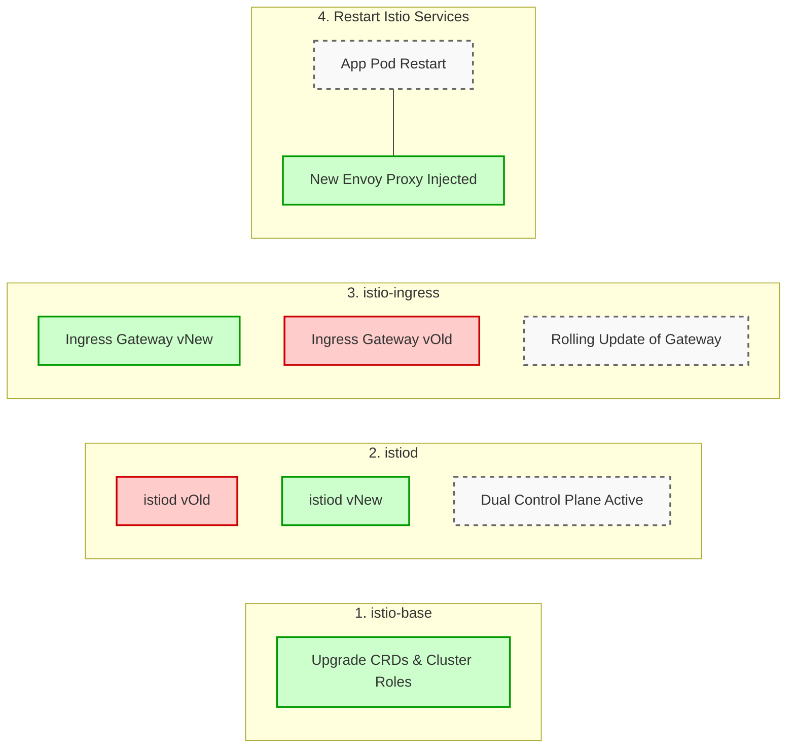

```mermaid
 graph LR
    %% Define Styles for clarity
    classDef new fill:#ccffcc,stroke:#009900,stroke-width:2px;
    classDef old fill:#ffcccc,stroke:#cc0000,stroke-width:2px;
    classDef base fill:#f9f9f9,stroke:#666,stroke-width:2px,stroke-dasharray: 5 5;

    %% BLOCK 1: ISTIO-BASE
    subgraph S1 ["1. istio-base"]
        direction TB
        Base[Upgrade CRDs & Cluster Roles]:::new
    end

    %% BLOCK 2: ISTIOD
    subgraph S2 ["2. istiod"]
        direction TB
        CP1[istiod vOld]:::old
        CP2[istiod vNew]:::new
        Note2[Dual Control Plane Active]:::base
    end

    %% BLOCK 3: ISTIO-INGRESS
    subgraph S3 ["3. istio-ingress"]
        direction TB
        IG1[Ingress Gateway vNew]:::new
        IG2[Ingress Gateway vOld]:::old
        Note3[Rolling Update of Gateway]:::base
    end

    %% BLOCK 4: RESTART SERVICES
    subgraph S4 ["4. Restart Istio Services"]
        direction TB
        Pod[App Pod Restart]:::base
        Sidecar[New Envoy Proxy Injected]:::new
        Pod --- Sidecar
    end
```