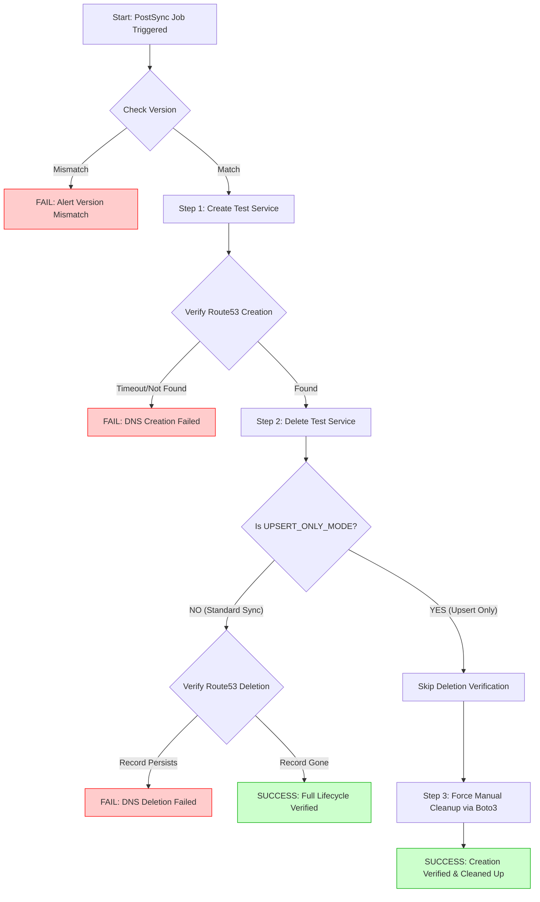

Here is the complete, standalone `README.md` file. You can copy and paste this directly into your repository.

---

# External-DNS Release Verifier

This tool provides automated "Black Box" verification for `external-dns` releases on EKS. It is designed to run as an **ArgoCD PostSync Job** in non-production environments (`ptdev`, `dev`, `stg`) to certify that a new version of `external-dns` is fully functional before it is promoted.

## 🌊 Verification Logic Flowchart

The following flowchart illustrates the decision logic for the verification process, including the specific handling of `upsert-only` environments to prevent "zombie" DNS records.



## 📋 Overview

This automation replaces manual "curl" or "dig" checks with a deterministic verification process. It handles the two primary operation modes of `external-dns`:

1. **Sync Mode (e.g., `ptdev`):** Verifies the full lifecycle (**Create**  **Verify**  **Delete**  **Verify**). This proves `external-dns` can *add* and *remove* records.
2. **Upsert-Only Mode (e.g., `stg`):** Verifies creation only. Since `external-dns` is forbidden from deleting records in these environments, the verifier creates the record, verifies it, and then **self-cleans** the Route53 record using the AWS API to prevent polluting the zone with test data.

## 🛠 Prerequisites

### AWS Permissions (IRSA)

The Pod running this image requires an IAM Role (IRSA) with the following Route53 permissions.

* **ListResourceRecordSets**: Required for verification.
* **ChangeResourceRecordSets**: Required **only** if running in `UPSERT_ONLY_MODE` (to perform self-cleanup).

### Kubernetes RBAC

The Job needs a ServiceAccount with permissions to:

* `create`, `get`, `delete` Services (to manage the test fixture).
* `get`, `list` Pods (to verify the running `external-dns` version).

## ⚙️ Configuration

The container is configured entirely via Environment Variables passed from your Helm Chart.

| Variable | Description | Required | Default |
| --- | --- | --- | --- |
| `AWS_REGION` | AWS Region (e.g., `ap-east-1`). | ✅ | `ap-east-1` |
| `HOSTED_ZONE_ID` | The Route53 Zone ID to test against. | ✅ | - |
| `TEST_DOMAIN_NAME` | FQDN for the test record (e.g., `ver-test.dev.mox.com`). | ✅ | - |
| `UPSERT_ONLY_MODE` | Set to `true` if the cluster forbids automatic deletions. | ❌ | `false` |
| `EXPECTED_VERSION` | The image tag expected to be running (e.g., `v0.15.0`). | ❌ | `latest` |
| `TARGET_NAMESPACE` | Namespace where the test Service is deployed. | ❌ | `af-toolkit` |

## 🚀 Deployment Guide

### 1. Build Image

```bash
docker build -t platform-docker-images/external-dns-verifier:v1.0.0 .

```

### 2. Helm Integration (ArgoCD)

Add this Job to your `af-toolkit` or `external-dns` Helm chart template.

**Example: `templates/verification-job.yaml**`

```yaml
{{- if .Values.verification.enabled }}
apiVersion: batch/v1
kind: Job
metadata:
  name: external-dns-verifier
  namespace: {{ .Values.verification.namespace | default "af-toolkit" }}
  annotations:
    # Runs AFTER the new external-dns pods are healthy
    argocd.argoproj.io/hook: PostSync
    # Deletes the Job on success to keep the cluster clean
    argocd.argoproj.io/hook-delete-policy: HookSucceeded
spec:
  backoffLimit: 0
  template:
    spec:
      serviceAccountName: external-dns-verifier-sa
      restartPolicy: Never
      containers:
      - name: verifier
        image: {{ .Values.verification.image }}
        env:
        - name: HOSTED_ZONE_ID
          value: {{ .Values.verification.hostedZoneId | quote }}
        - name: TEST_DOMAIN_NAME
          value: "ext-dns-verify-{{ .Values.cluster.name }}.dev.mox.com"
        - name: EXPECTED_VERSION
          value: {{ .Values.image.tag | quote }}
        # Set this to true for STG if STG uses upsert-only policy
        - name: UPSERT_ONLY_MODE
          value: {{ .Values.verification.upsertOnly | default "false" | quote }}
{{- end }}

```

## 🛡 Safety Mechanisms

1. **Prefix Lock:** The verification script includes a safety lock. It will **refuse** to perform manual cleanup on any domain that does not start with specific prefixes (e.g., `ext-dns-`, `ver-test`), preventing accidental deletion of production records if the configuration is incorrect.
2. **Self-Cleanup:** If the test fails in `ptdev` (Sync Mode), the script attempts to clean up the Kubernetes Service to avoid leaving orphan resources in the cluster.

## 🚨 Troubleshooting

If the verification Job fails, the ArgoCD sync will be marked as Failed.

**Steps to resolve:**

1. **Check Job Logs:**
```bash
kubectl logs job/external-dns-verifier -n af-toolkit

```


2. **Manual Cleanup (K8s):**
If the script crashed before cleanup, remove the test service:
```bash
kubectl delete svc external-dns-test-service -n af-toolkit

```


3. **Manual Cleanup (Route53):**
If the script failed to delete the DNS record, manually remove the `TEST_DOMAIN_NAME` record via AWS Console or CLI.