You are absolutely right. The current "Key Features" and "Execution Steps/How It Works" are repeating the same information (like "Smart Detection" appearing in both).

To fix this, we will structure it so:

1. **Key Features** describes the **benefits** (Why use this?).
2. **How It Works** describes the **process** (What does the script actually do step-by-step?).

Here is the revised, concise version for your README.

### 1. Revised Key Features

*Focus on the "Why" (Capabilities).*

## ✨ Key Features

* **Zero-Config Adaptation:** Automatically inspects the live `external-dns` pod to determine which sources (Service, Ingress, Istio) to test and which policy mode (`sync` vs `upsert-only`) to enforce.
* **Isolated Execution:** Runs entirely within an ephemeral namespace (`verification-external-dns-...`) that is destroyed after testing, ensuring no interference with production workloads.
* **CI/CD Ready:** Returns standard exit codes (0 or 1) and handles `SIGTERM` gracefully, making it perfect for ArgoCD PostSync hooks.

---

### 2. Revised How It Works

*Focus on the "How" (The Lifecycle). This text replaces your "Execution Steps" list entirely.*

## 🧠 How It Works

The script follows a strictly sequential lifecycle to verify the DNS loop:

1. **Discovery:** The script connects to the cluster, identifies the active `external-dns` pod, and learns its configuration.
2. **Setup:** It creates a temporary Kubernetes namespace with restricted RBAC permissions.
3. **The Verification Loop:** For each detected source:
* **Deploy:** Creates a test resource with a unique hostname.
* **Verify Creation:** Polls Route53 until the record appears.
* **Verify Deletion:** (If in `sync` mode) Deletes the resource and confirms the record is removed from Route53.

4. **Teardown:** The temporary namespace is deleted, instigating an automatic cleanup of all test resources.

### Logic Flowchart

```mermaid
flowchart TD
    classDef process fill:#e6fffa,stroke:#2c7a7b,stroke-width:2px;
    classDef decision fill:#fffaf0,stroke:#c05621,stroke-width:2px;
    classDef fail fill:#fff5f5,stroke:#c53030,stroke-width:2px;

    Start([🚀 Start Job]) --> Detect[🔍 Detect Config]
    Detect --> Setup[🛠 Create Temp Namespace]:::process

    Setup --> LoopStart{For Each Source}:::decision
    
    subgraph TestLoop [Verification Cycle]
        LoopStart --> PreClean[Clean Route53 State]
        PreClean --> Deploy[Deploy Test Resource]
        Deploy --> CheckCreate{DNS Created?}:::decision
        
        CheckCreate -- No --> Fail[❌ Failure Detected]:::fail
        CheckCreate -- Yes --> ModeCheck{Is 'Sync' Mode?}:::decision
        
        ModeCheck -- Yes --> K8sDelete[Delete K8s Resource]
        K8sDelete --> CheckDelete{DNS Deleted?}:::decision
        CheckDelete -- No --> Fail
        CheckDelete -- Yes --> Cleanup
        
        ModeCheck -- No (Upsert) --> Cleanup[🧹 Force Route53 Cleanup]
    end

    Cleanup --> LoopStart
    LoopStart -- Done --> Teardown[🗑 Delete Namespace]:::process
    Fail --> Teardown
    Teardown --> End([✅ Exit]):::process

```

